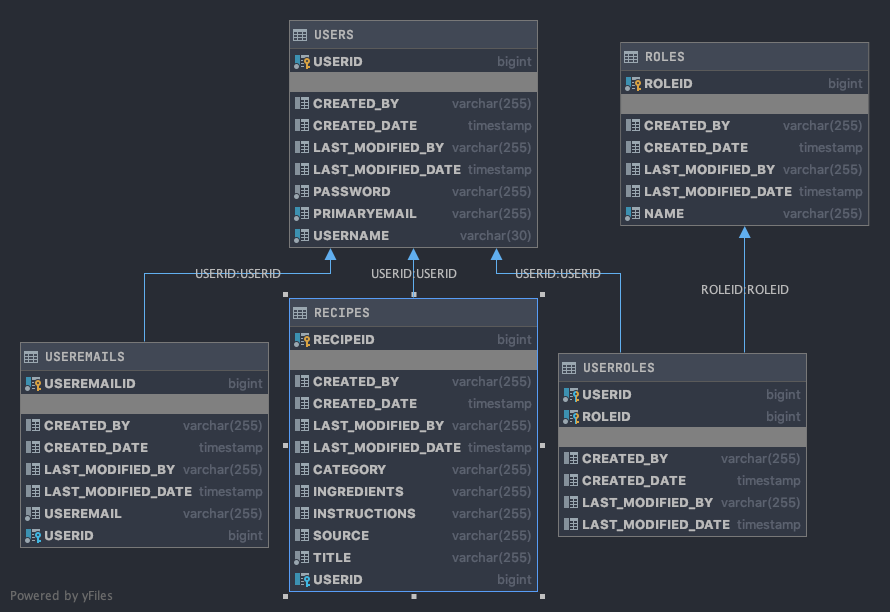

# Secret Family Recipes | Spring Boot API


## Getting Started:
1. Heroku deployment can be found here: <ins>https://secret-recipe-5.herokuapp.com/</ins></i></b>
2. *IMPORTANT* You need to include a clientid and clientsecret within axios calls to access API

```
 headers: {

   // btoa is converting our client id/client secret into base64
   Authorization: `Basic ${btoa('lambda-client:lambda-secret')}`,
   'Content-Type': 'application/x-www-form-urlencoded'

  }
```

## Overview and Table Relationships



**Users** have a *OneToMany* relationship with **Recipes** and **Roles**
while **Recipes** has a *ManyToOne* relationship with **Users**


## Endpoints:
* Example endpoint would be **https://secret-recipe-5.herokuapp.com/users** if using deployed backend.

#### Register/Login/Logout Endpoints

| Action | Endpoint | Description
|---|---|---|

| POST | `/createnewuser` | Creates a new user |

| POST | `/login` | Allows user to login and returns token |
| GET | `/logout` | Destroys current session and logs a user out |

#### Shape of User Required to Register (JSON):
```
{
    "username": "admin",
    "password": "password",
    "primaryemail": "email@email.com"
}
```
#### The Data Returned by Server After Registering:
```
{
    "access_token": "ec0dee16-7297-4dc5-bc80-92cc14c5502d",
    "token_type": "bearer",
    "scope": "read trust write"
}

```

#### Shape of User Required to Login (JSON):
```
{
    "username": "admin",
    "password": "password"
}

```
#### The Data Returned by Server After Logging In:
```

```

#### User Endpoints

| Action | Endpoint | Description
|---|---|---|
| GET | `/users/users` | If user is logged in, returns an array of all other users |
| GET | `/users/user/:id` | If user is logged in, returns the user with the specified ID |

| GET | `/users/contains/:query` | If user is logged in, returns the users with names containing query |
| POST| `/users/users` | Add new user after being logged in|
| PUT | `/users/user/:id` | Edits user with specified ID |
|PATCH| `/users/user` | Allows you to edit specific data points without sending entire required JSON(unlike PUT) |

| DELETE | `/users/user/:id` | Deletes user with specified ID |

##### NOTE: To access any of these user endpoint, you will need token authentication, which can be passed after a user login is performed.
  * Example:
  ```
axios.post('http://localhost:2019/login', `grant_type=password&username=${this.state.username}&password=${this.state.password}`, {

      headers: {

        // btoa is converting our client id/client secret into base64
        Authorization: `Basic ${btoa('lambda-client:lambda-secret')}`,
        'Content-Type': 'application/x-www-form-urlencoded'

      }

    })
      .then(res => {

        localStorage.setItem('token', res.data.access_token);
        this.props.history.push('/users');

      })
      .catch(err => console.dir(err));

    e.preventDefault();

  }
  ```

#### Recipe Endpoints

| Action | Endpoint | Description
|---|---|---|
| GET | `/recipes/recipes` | If user is logged in, returns an array of all recipes (theirs and those of other users) |
| GET | `/recipes/recipe/:recipeid` | If user is logged in, returns the recipe with the specified ID |
| GET | `/recipes/recipes/:userid` | If user is logged in, returns the recipes associated with the specified user ID |
| POST | `/recipes/recipe` | Adds a recipe to currently logged in user |
| PUT | `/recipes/recipe/:id` | Edits recipe with specified ID |
| DELETE | `/recipes/recipe/:id` | Deletes recipe with specified ID |

#### The Data Returned by Server After GET `/recipes/recipes`:
```
[
    {
        "recipeid": 3,
        "title": "Testing Recipe",
        "source": "My Nana",
        "ingredients": "Water",
        "instructions": "Put water in glass",
        "category": "2",
        "user": {
            "userid": 1,
            "username": "james",
            "primaryemail": "email@email.com",
            "roles": []
        }
    }
]
```
#### The Data Returned by Server After GET `/recipes/recipe/:recipeid`:
```
{
    "recipeid": 3,
    "title": "Testing Recipe",
    "source": "My Nana",
    "ingredients": "Water",
    "instructions": "Put water in glass",
    "category": "2",
    "user": {
        "userid": 1,
        "username": "james",
        "primaryemail": "email@email.com",
        "roles": []
    }
}
```
#### The Data Returned by Server After GET `/recipes/recipes/:userid`:
```
{
    "recipeid": 3,
    "title": "Testing Recipe",
    "source": "My Nana",
    "ingredients": "Water",
    "instructions": "Put water in glass",
    "category": "2",
    "user": {
        "userid": 1,
        "username": "james",
        "primaryemail": "email@email.com",
        "roles": []
    }
}
```
#### The Data Returned by Server After POST `/recipes/recipes`:
```
created item:

```
#### The Data Returned by Server After PUT `/recipes/recipe/:id`:
```
Item has been updated

```
#### The Data Returned by Server After DELETE `/recipes/recipe/:id`:
```
Item has been deleted

```
